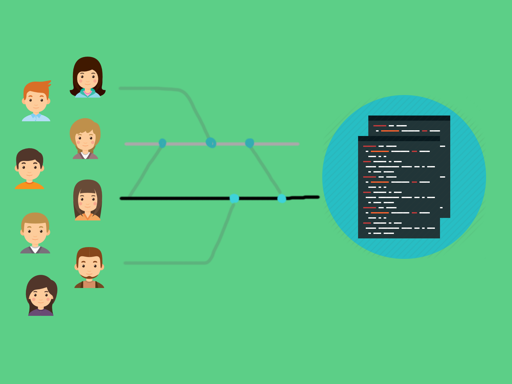
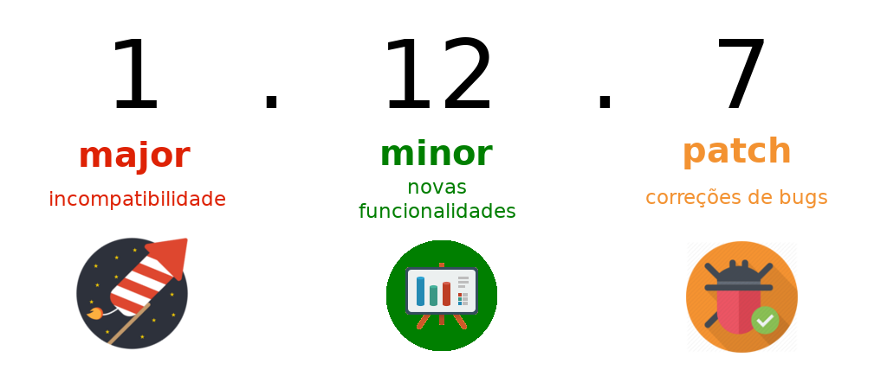

# SCM e Versionamento de Código efetivo: Git, Gitlab e Gitflow

## .1 Problemas


## .2 Solução Proposta



## Não Reinvente a Roda
### .1 Patterns, Linguagem Comum

A maneira mais efetiva de iniciar um trabalho, que envolve muitas pessoas, diversas equipes, é definir uma **liguagem comum**, falar o mesmo protocolo, sempre fez, e provavelmente fará parte de nossa evolução tecnológica.

Para isso existem os Padrões! E, mesmo que você não seja um fã do mundo acadêmico, conhece, ou ao menos já **ouviu falar** de alguns Patterns do mundo da tecnologia como: Observer, Factory, Filter, Proxy, etc...

Quando alguém fala 'Este projeto tem arquitetura MVC', você imagina na hora as 3 camadas: model, view e controller, certo?

Para o mundo de **SCM** isso não é diferente, exitem patterns, que muitas vezes, infelizmente, são negligenciados. Ou tão pouco são de conhecimento público, mesmo sendo a melhor saída de dar qualidade e produtividade, aos times de desenvolvimento.

## Git, GitLab, GitHub, Gitflow, entenda o que são!
### .1 Introdução

Vamos, antes de mais nada, entender o que quer dizer cada sigla, ou nome desses:

**Git:** é a nossa ferramenta de SCM distribuído, pode-se dizer que é uma evolução dos modelos centralizados como o SVN e CVS.

**Git -hub -lab:** são plataformas desenvolvidas para operar sob o GIT, num modo bem simplista, são interfaces que facilitam a utilização (além de adicionar outras features) ao GIT.

**Gitflow:** este nome tem o prefixo 'git' por mera 'coincidência' (ou jogada) do autor, se trata de um pattern de versionamento, e não está ligado de nenhuma forma ao git.

### .2 GitLab: Grupos, Projetos e Acessos
Este passo a passo será feito via hands-on:

1. Novo grupo
2. Novo Projeto
3. Inserção de Membros

### .3 Git: Versionando nosso Projeto

Agora já temos nosso repositório pronto para receber os códigos, vamos instalar o [Client GIT](https://git-scm.com/downloads). Uma alternativa bem famosa aos usuários Windows é o [Git Bash](https://gitforwindows.org/). Após a instalação é hora de versionar nosso código:

1. `git init`
2. `git add`
3. `git commit`
4. `git push`

E, por último e não menos importarte, o [manual da ferramenta](https://git-scm.com/book/pt-br/v2)!
Tome este como seu guia de referência, ele é muito bem escrito (e ilustrado).

OBS.: Para quem não é muito fã de terminal, futuramente poderá também utilizar um [GUI GIT](https://git-scm.com/downloads/guis)

## Gitflow, nosso maestro
### .1 Prazer, Gitlflow

O Gitflow é um modelo, com um conjunto muito simples de regras, que orquestram desenvolvimentos paralelos.
Antes de iniciarmos, entenam que, este modelo pode ser aplicado em qualquer ferramenta de SCM!
Estamos falando simplesmente de um modelo organizacional lógico!


[Referência](http://nvie.com/posts/a-successful-git-branching-model/)

É claro que, como todo curso do [Missão DevOps](http://www.missaodevops.com.br/), faremos tudo na prática também!

### .2 Estruturas de Branch

Vamos direto ao ponto, no bom format card iremos conhecer os tipos de branches:

master
------
**Descrição:** Esta branch é a mais importante, reflete nosso código produtivo! <br/>
**Tipo:** Principal <br/>
**Tempo de Vida:** Infinito <br/>
**Criada de:** N/A <br/>
**Pode ir Para:** develop <br/>

develop
------
**Descrição:** Contém os códigos do próximo release, também conhecido como branch de integração, onde rolam os night builds!
Quando a branch develop estiver pronta para entrar em produção, um 'merge back' é feito para a branch master.
E, logo após isso, uma tag com a nova versão deve ser gerada, e é neste ponto que um scrit de entrega para produção deve ser executado, preferencialmente via hookscript. <br/>
**Tipo:** Principal <br/>
**Tempo de Vida:** Infinito <br/>
**Criada de:** master (uma única vez) <br/>
**Pode ir Para:** master <br/>

feature/*
------
**Descrição:** Esta linha é criada para desenvolver uma nova funcionalidade, e ela só deverá existir nesse espaço de tempo.
A ida da feature-branch ao origin é opcional. Uma feature branch pode também ter seu desenvolvimento cancelado por N motivos. <br/>
**Tipo:** Suporte <br/>
**Tempo de Vida:** Finito <br/>
**Criada de:** develop <br/>
**Pode ir Para:** develop <br/>

release-*
------
**Descrição:** Viabiliza ajustes finos e prepara os metadados (version numbers, notes, ...), e libera a linha de develop para receber conteúdos do próximo release. <br/>
**Tipo:** Suporte <br/>
**Tempo de Vida:** Finito <br/>
**Criada de:** develop <br/>
**Pode ir Para:** develop & master <br/>

hotfix
------
**Descrição:** Correção de erros identificados em ambiente produtivo. <br/>
**Tipo:** Suporte <br/>
**Tempo de Vida:** Finito <br/>
**Criada de:** master <br/>
**Pode ir Para:** master & develop <br/>

## SCM
### .1 Versionamento Semântico

Vamos conhecer agora o pattern mais utilizado, em todas comunidades e times, sejam eles open-source ou não:



[Semantic Versioning](https://semver.org/lang/pt-BR/)

Este é um tema tão pouco abordado, que até mesmo documentações de referência, [deixam a desejar](http://nvie.com/posts/a-successful-git-branching-model/#creating-a-release-branch)
E agora vamos mergulhar ainda mais fundo no mundo de SCM!

## Workflow
### .1 Feature Branch: Nova Funcionalidade

Criando uma feature branch: `git checkout -b feature/novo-rodape develop`
`#showMeTheCode`

### .2 Feature Desenvolvida: go to Develop

Agora retornaremos a branch de develop e realizaremos o merge:

```
$ git checkout develop
$ git merge --no-ff feature/novo-rodape
$ git branch -d feature/novo-rodape
$ git push origin develop
```

Para detalhes sobre [Merge](https://git-scm.com/book/pt-br/v1/Ramifica%C3%A7%C3%A3o-Branching-no-Git-B%C3%A1sico-de-Branch-e-Merge), a documentação do git é muito bem escrita.

### .3 Releasing

Vamos criar nossa branch de Release:

```
$ git checkout -b release-1.4 develop  
$ ./version-number-to.sh 1.4  
$ git commit -a -m "Version Numbers e metadados atualizados"  
```

O script `version-number-to.sh` é responsável por atualizar os Version Numbers e Metadados.
Neste ponto podemos apenas fazer correções pontuais, nunca desenvolver novas features.
É importante também que essa branch viva por um curto espaço de tempo.

### .4 Produção

Agora que temos nossa branch de release em 100% o fluxo é simples:

1. Merge para a master e criação da Tag

```
$ git checkout master
$ git merge --no-ff release-1.4
$ git tag -a 1.4
```

2. Merge back para a develop (garantindo propagação de eventuais bugfixes)
Neste ponto, podem ocorrer também pequenos conflitos a serem resolvidos.

```
$ git checkout develop
$ git merge --no-ff release-1.4
```

3. E por último, e não menos importante:

```
$ git branch -d release-1.4
```

### .5 O temido Hotfix

Houston, we have a problem!
Quando um erro explode em produção, temos que corrigí-lo de maneira rápida, precisa e garantir que nenhuma linha de código se perca!
Então, mão na massa:

1. Criar branch de hotfix

```
$ git checkout -b hotfix-1.4.1 master
$ ./version-number-to.sh 1.4.1
$ git commit -a -m "Bumped version number to 1.4.1"
```

2. Corrigir o erro e atualizar os fontes

```
$ git commit -m "Corrigido Problema Produtivo!"
```

3. Merge back para o master e criação de tag

```
$ git checkout master
$ git merge --no-ff hotfix-1.2.1
$ git tag -a 1.2.1
```

4. Merge back para develop

```
$ git checkout develop
$ git merge --no-ff hotfix-1.2.1
```

E, caso exista uma release branch o merge deverá ser feito nela ao invés da develop, pois neste ponto a develop já pode ter recebido uma nova major version.

Referências: [nvie.com](http://nvie.com/posts/a-successful-git-branching-model/)

## Extra: Integração Contínua
### .1 Interface SCM x CI
Ok! E agora? Nesta aula extra vamos entender os próximos passos, pois estamos entrando agora nas fronteiras da Integração Contínua!
`hands-on!`
